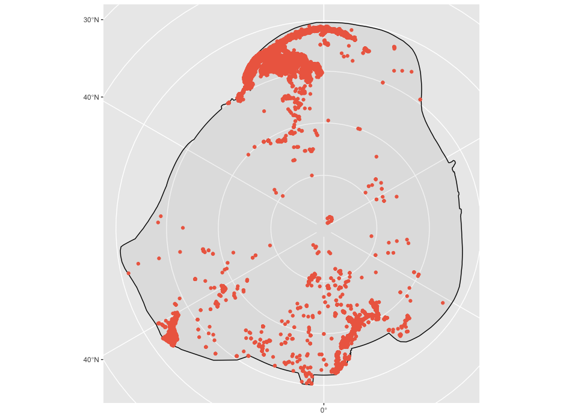
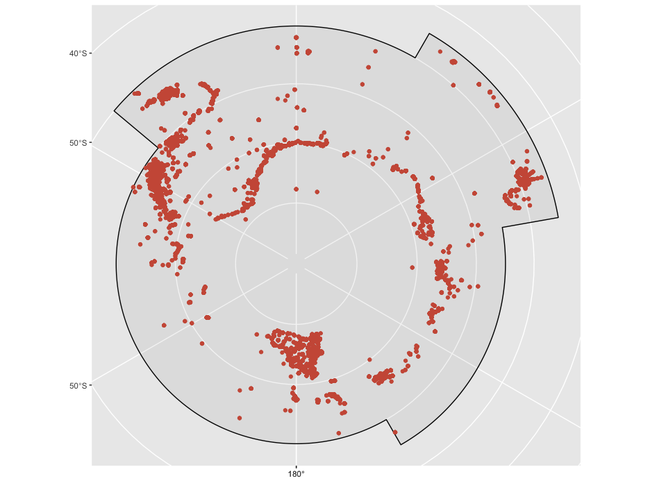
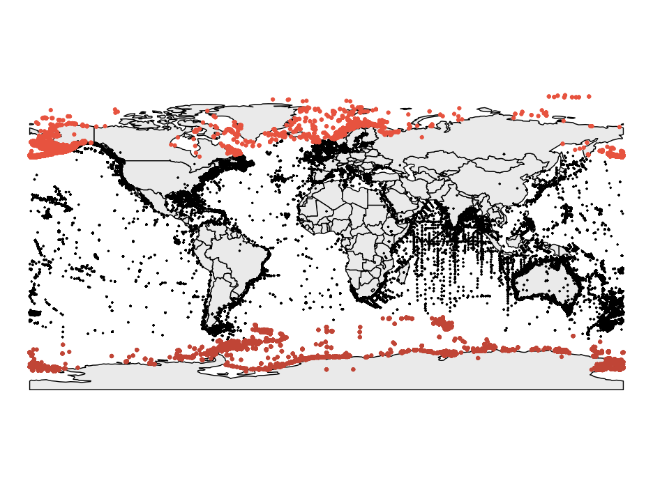

# demo-polar

Demo of intersecting OBIS records and arctic or antarctic geometries. Shapefiles from [CCAMLR](https://github.com/ccamlr/CCAMLRGIS), [CAFF](http://geo.abds.is/geonetwork/srv/api/records/f0eb86a7-e408-4138-9432-dedb991f13d1) and [AMAP](https://www.amap.no/work-area/document/868).

